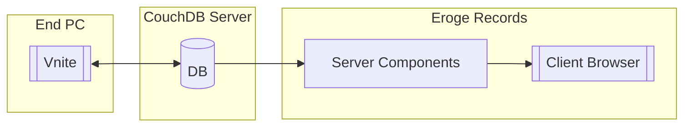

# Eroge Records

A personal Eroge playing records tracking website

## Overview

The main purpose of building this website is not the website itself, but rather I want to try out a complete workflow of building things with agents from the very beginning to the end.
That said, this project was about 70% percent written by agents, then reviewed and modified by human or continued to be iterated by agents. You can find complete instructions and prompts I used in the process of building this website in the project's folder, they are:

- `AGENTS.md`: A project overview README for agents
- `.github/chatmodes`: Chat modes I have used
- `.github/prompts`: Prompts I have used
- `agents/*`: Documents created by agents

## Data

The data originates from a self-hosted CouchDB server also used for synchronization with [Vnite](https://github.com/ximu3/vnite). Think of the entire data flow like this:

